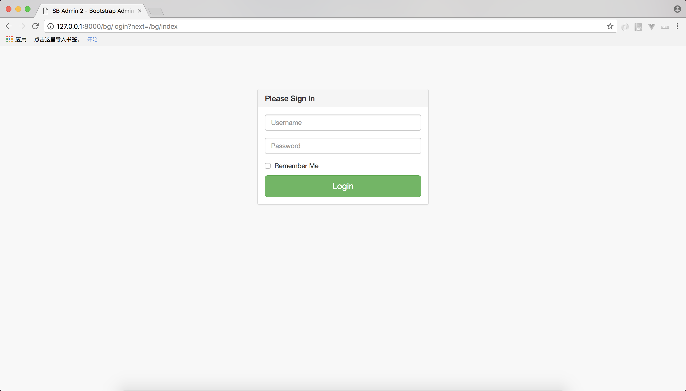
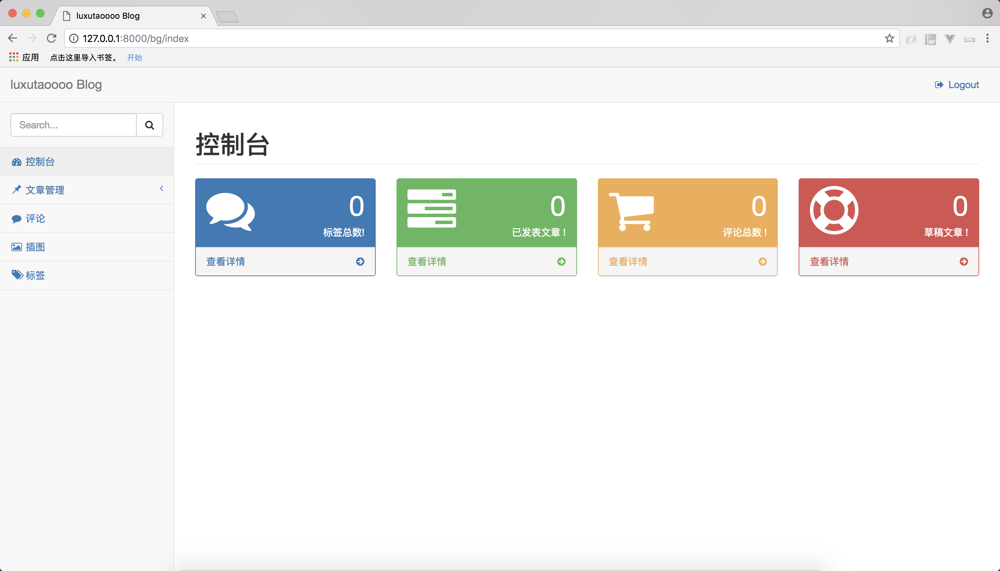
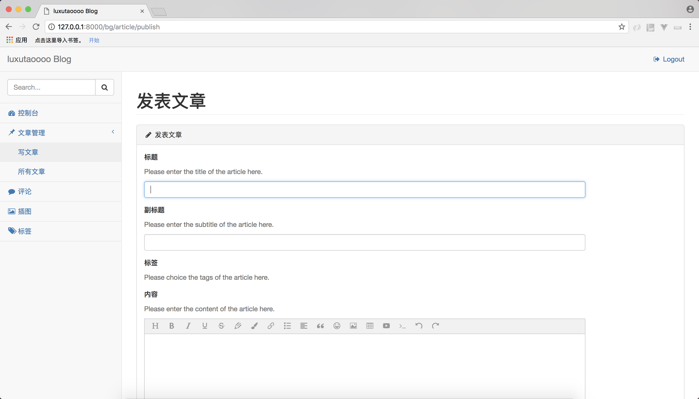

### 初始化数据
------------
> 执行`python3 manage.py makemigrations website`和`python3 manage.py migrate website`生成自定义数据表.
> 执行`python3 manage.py migrate`生成Django自带的表
> 然后执行`python3 manage.py loaddata init_db`或者`python3 manage.py init_db`会初始化一个默认的标签。 
> `python3 manage.py createsuperuser`创建一个后台管理用户

### 编辑器 
------------
> 引入wangEditor编辑器，后台写入文章支持多种编辑及插入。 

### 前端界面
------------
> 引入自[黄轩博客](https://huangxuan.me)及[github](https://github.com/huxpro) 

### 简单评论系统
------------
> 只可以单独的进行一些发表文字之类的操作，头像为随机显示，目录为`/static/img/comment/`  

### 后台登录地址
------------
> 后台登录：(访问地址/bg/index)

### 引入图片
------------
> 暂时测试的引入图片需要使用上传图片到数据库中，然后引入当前域名下的图片地址链接。

